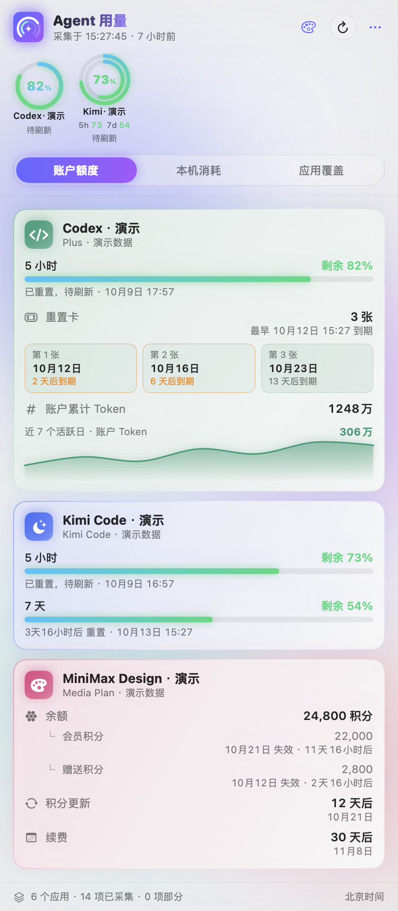
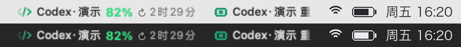
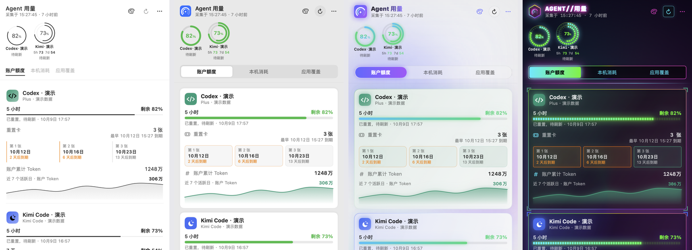
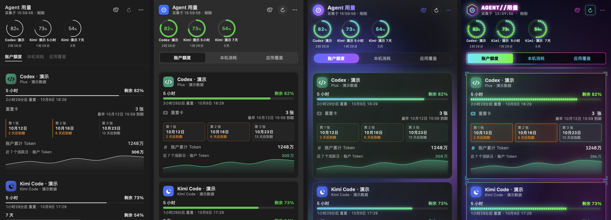
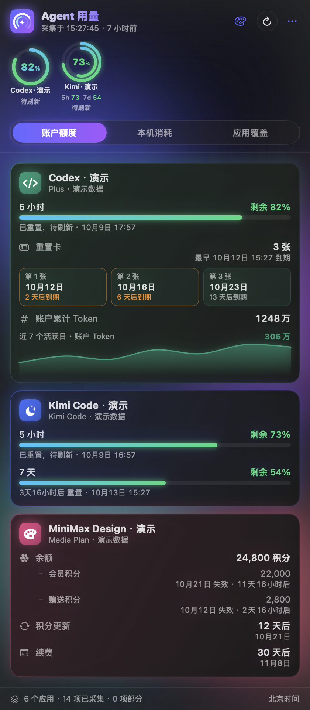
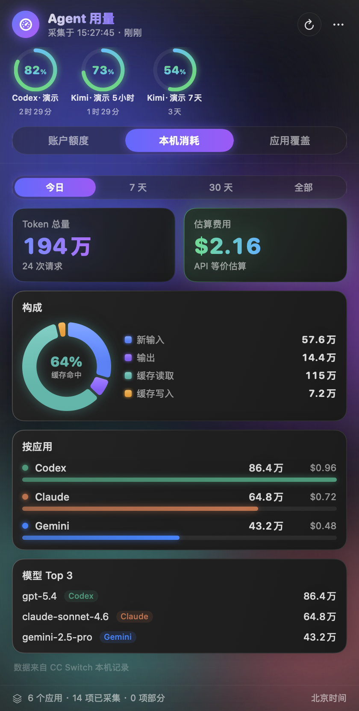
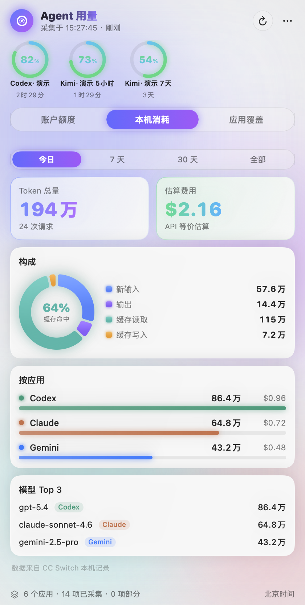
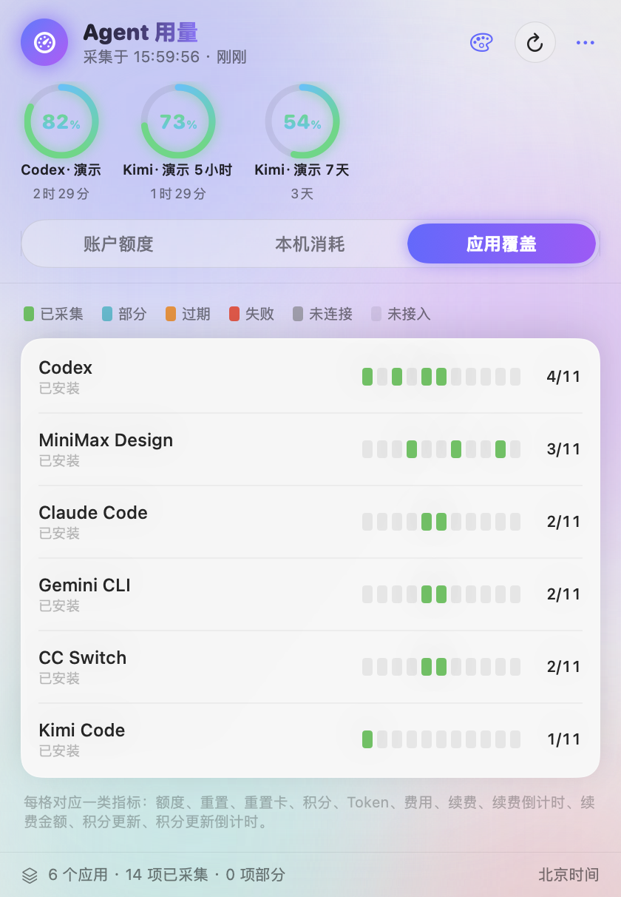
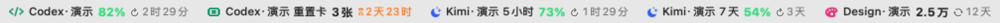
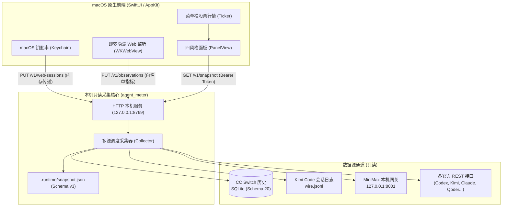

# AgentMeter · Agent 用量

<p align="center">
  
</p>

<p align="center">
  <strong>专为开发者与创作者打造的 macOS 菜单栏 AI Agent 用量与额度大盘</strong><br />
  实时聚合账户额度 · 重置倒计时 · 重置卡库存 · 创作积分 · 本机 Token 消耗流
</p>

<p align="center">
  
  
  
  
  
  
  
  <a href="LICENSE"></a>
</p>

> 下方截图由 App 离线预览生成，所有账户、余额和用量均为虚构演示数据，不代表真实账户或全部来源的接入情况。

---

## 💡 为什么需要 AgentMeter？

在使用各类 AI 辅助编程与创作工具（Codex、Claude Code、Kimi Code、Qoder、TRAE、MiniMax、即梦等）时，你是否常遇到以下痛点：

- 📉 **用量焦虑与分散查询**：额度分散在各种网页后台、控制台或本地配置里，每次查询都要反复登录或点开多个面板；
- ⏳ **重置卡悄然过期**：好不容易领到的 5 小时卡、周重置卡还没来得及用，就已经过了有效期；
- 🚨 **额度突发告急**：编码正处于关键思路阶段，工具突然触发限流，打断专注心流；
- 💰 **会员续费与扣费遗忘**：多平台的月付、年付会员何时扣款、何时刷新积分缺乏统一跟踪；
- 📊 **缺少统一视角的本地开销账本**：不同 Agent 客户端的 Token 消耗、缓存命中率与估算费用散落各处，难以聚合。

**AgentMeter（Agent 用量）** 正是为此而生：以极低资源开销常驻 macOS 菜单栏，像**股票大盘**一样滚动轮播你的所有 Agent 核心额度，支持多级阈值告警，并在本地建立精准去重的 Token 与费用透析大盘。

---

## ✨ 核心亮点

```
┌────────────────────────────────────────────────────────────────────────┐
│  Menubar:   [Codex 82% 2h31m]  [Claude 65% 4d]  [Kimi 91% 1d]  ...   │
└───────────────────────────────────┬────────────────────────────────────┘
                                    │ 点击弹出
┌───────────────────────────────────▼────────────────────────────────────┐
│ ✦ 四套界面风格面板：极简 · 原生 · 极光 · 霓虹 (AgentMeterBar)          │
│ ├─ 顶部驾驶舱：核心平台迷你仪表一字排开，一键直达应用                   │
│ ├─ 账户额度：各供应商统一卡片——额度窗口、积分钱包、重置卡、续费提醒    │
│ ├─ 本机消耗：CC Switch 历史 + Kimi Code 真实会话 Token 双流去重合并     │
│ └─ 应用覆盖：已检测 24+ Agent 应用的原生状态矩阵                       │
└────────────────────────────────────────────────────────────────────────┘
```

### 1. 📈 股票大盘式菜单栏行情条（Ticker）
- **Core Animation 硬件加速横向滚动**：默认平滑滚动显示「图标 + 名称 + 剩余量 + 剩余时间」，CPU 占用仅约 **0.4%**。
- **动态涨跌感**：额度百分比根据余量自动变色，当余量变动时带 ▲ / ▼ 提示（绿色代表余量充裕/恢复，红色代表被消耗）。
- **多种呈现模式自由切换**：支持滚动轮播（宽度 160/220/300 自选）、逐条翻动、最紧张额度优先、今日 Token 汇总或极简图标模式。

<p align="center">
  
</p>

### 2. 🔔 阶梯式预警与系统通知（Notifier）
- **额度告急提醒**：剩余低于阈值（默认 20%，可选 10%/30%）、跌破 5%、耗尽时自动发送原生系统通知；
- **重置卡/积分临期提醒**：3 天内与 24 小时内即将过期的重置卡或临时积分包重点提醒；
- **订阅周期提醒**：3 天内自动续费扣款提醒、7 天内会员到期（未开启自动续费）提醒；
- **防打扰机制**：同一事件仅提醒一次，点击通知即可直接定位打开面板。

### 3. 🎨 四套界面风格，一键切换（SwiftUI + AppKit）
- **从极简到绚丽**：面板标题栏的调色板按钮或设置菜单「界面风格」随时切换，立即生效并记住选择：
  - **极简**：黑白排版，无卡片、无阴影，只在额度紧张时出现颜色；
  - **原生**：macOS 系统实色卡片与系统色，干净克制；
  - **极光**（默认）：流光底色、毛玻璃卡片与品牌色微光；
  - **霓虹**：赛博深色、彩虹描边与 HUD 角标、分段 LED 进度条，背景光效由 Core Animation 驱动，打开面板几乎不增加 CPU；
- **统一的供应商卡片**：各来源按同一顺序展示「额度窗口 → 积分钱包 → 积分更新 → 重置卡 → 续费 → Token」，额度窗口从短到长排列，倒计时按紧急程度而非品牌色着色；
- **Swift Charts 消耗分布图**：将输入、输出、缓存命中等构成以环形图直观呈现，深色/浅色模式自适应。

<p align="center">
  
  
</p>
<p align="center"><sub>从左到右：极简 · 原生 · 极光 · 霓虹（霓虹固定深色）</sub></p>

<p align="center">
  
  
</p>

<details>
<summary>查看更多截图：本机消耗、应用覆盖与菜单栏行情</summary>

<p align="center">
  
  
</p>

<p align="center">
  
</p>

截图生成方式见 [截图说明](docs/images/README.md)。

</details>

### 4. 👥 多账号隔离支持（Multi-Account）
- 每个网页登录来源支持最多 **5 个独立账号**（如「主号」、「小号」、「工作号」）；
- 每个账号**独立成卡、独立进大盘行情条、独立计算提醒阈值**，严禁将不同账号的额度粗暴相加；
- 后端规范命名通道（首个账号保持原源名，后续账号分配 `provider#2` 并关联备注）。

### 5. 🔀 智能双流合并本机消耗（Dual-Stream Accounting）
- **历史主库**：通过只读事务与一致性连接读取 **CC Switch (Schema 20)** 历史数据库；
- **增量会话**：毫秒级解析 **Kimi Code** 本机 `~/.kimi-code/sessions/**/wire.jsonl`，提取唯一 `turn` 作用域真实 Token；
- **严密去重**：明确区分 CC Switch 路由的 `kimi-for-coding` 与独立的 Kimi Code 桌面端，相加绝不重叠；对缺少定价的记录或下界统计明确标注，绝不捏造虚假账单。

### 6. 🎨 创作类工具专属指标支持（Creative Metering）
- **MiniMax Design**：读取当前个人 Media Plan 钱包余额，精准追踪积分包失效时间与次月积分刷新倒计时；
- **即梦 (Dreamina)**：内置隐藏 Web 监控视图，定期在后台拦截自身发出的安全查询响应，直观展现会员等级、积分明细与续费倒计时。

---

## 🛡️ 安全与设计原则（Security First）

我们深知开发者对**隐私与凭据安全**的极高要求。AgentMeter 遵循以下铁律设计：

> [!IMPORTANT]
> 1. **100% 只读保障 (Strictly Read-Only)**：核心逻辑绝不包含任何买入、兑换重置卡、更改套餐、发送模型 Prompt 的操作。
> 2. **凭据零泄露 (Zero Credential Leakage)**：
>    - 网页 Session 与 API Key 仅保存在 macOS 系统的钥匙串（Keychain）中；
>    - 传输给本机后端时仅通过 loopback 内存通道（`PUT /v1/web-sessions`），不写入快照文件或日志；查询时仅发送给对应服务的官方端点；
>    - 快照与对外接口中，账号标识一律经过 SHA-256 散列并截断（`account_key`），绝不泄漏原始用户 ID。
> 3. **数据诚实性 (Honest Metrics)**：
>    - **未提供 ≠ 0**：接口未返回的字段明确标为 `not_provided`，严禁脑补为 0；
>    - **不同质不相加**：不同服务商的积分、Token、重置卡绝不机械求和；
>    - **时间精度保真**：天级精度的续费日期不伪造秒级时刻，过期日期真实呈现 overdue 状态。

---

## 📋 数据源支持矩阵

| 数据源 | 覆盖应用 / 场景 | 获取方式 | 支持指标 | 账号隔离 |
| :--- | :--- | :--- | :--- | :---: |
| **Codex** | ChatGPT / Codex CLI | 本机配置与官方端点只读解析 | 额度余量、周重置时间、重置卡库存及到期、Token 汇总 | 独立账户 |
| **Claude Code** | Claude Code CLI | 钥匙串 OAuth 令牌只读获取 | 5 小时 / 7 天窗口额度与重置时刻 | 独立账户 |
| **Kimi Code** | Kimi 编程助手 | 本机 REST + 本机 `wire.jsonl` | 周/5小时额度、Token 消耗流（turn 级精准解析） | 独立账户 |
| **Qoder CN** | Qoder 中国区 | 内嵌安全网页登录 / Cookie | 总体额度、共享额度、已用/剩余、下次重置时间 | 最多 5 账号 |
| **WorkBuddy** | WorkBuddy 腾讯协作 | 内嵌安全网页登录 / Cookie | 资源包总量、剩余量、冻结积分、周期截止时间 | 最多 5 账号 |
| **TRAE CN** | 字节 TRAE IDE / SOLO | 内嵌安全网页登录 / Cloud-IDE-JWT | 权益包额度汇总、已用额度、有效积分 | 最多 5 账号 |
| **MiniMax Code** | MiniMax Coding Plan | 环境变量 / 钥匙串 API Key | 周套餐余量百分比、到期时间 | 独立账户 |
| **MiniMax Design** | MiniMax 创作工作台 | 本机安全网关 `127.0.0.1:8001` | 个人钱包、积分包失效期、月积分刷新日、年费续费倒计时 | 个人 Media Plan |
| **即梦 (Dreamina)** | 剪映即梦创作平台 | 内嵌隐藏 Web 视图白名单捕获 / CLI | 会员等级、积分总额、多积分包到期、续费状态 | 最多 5 账号 |
| **DeepSeek API** | DeepSeek 开放平台 | 环境变量 / 钥匙串 API Key | 货币余额（CNY/USD 独立保留） | 独立账户 |
| **CC Switch** | 本机多模型路由历史 | 本机 SQLite 数据库只读事务 | 今日/7天/30天/全部 Token、缓存命中率、估算费用 | 本机聚合 |

---

## 🏗️ 架构概览



---

## 🚀 快速上手

### 方式一：下载即用（推荐）

1. 从 [Releases · v0.2](https://github.com/Gary23333/agent-meter/releases/tag/v0.2) 页面下载最新的安装镜像：
   - 📦 `AgentMeter-0.2.0-macos-arm64.dmg`
2. 打开 DMG，将 `Agent 用量.app` 拖入 `Applications`（应用程序）文件夹；
3. 双击启动应用。菜单栏将立即出现小组件图标与默认行情条。
   - *App 包含独立 Python 后端，无需安装 Python、Xcode 或项目源码。各来源仍需对应客户端/登录态。*

当前使用 ad-hoc 签名，尚未做 Apple 公证；首次打开可能需要在系统设置中允许。详见 [安装说明](docs/INSTALL.md) 和 [发布说明](docs/release-v0.2.md)。安装版数据位于 `~/Library/Application Support/AgentMeter/.runtime/`。

### 方式二：从源码构建原生应用

环境要求：macOS 14.0+，Xcode / Swift 5.10+、Python 3.9+ 和固定版本的 PyInstaller。

```sh
# 1. 克隆代码仓库
git clone git@github.com:Gary23333/agent-meter.git "AgentMeter"
cd "AgentMeter"

# 2. 安装打包依赖，构建 App 和 DMG
python3 -m pip install -r requirements-build.txt
sh scripts/build-dmg.sh
```

构建产物输出至 `release/`：App、DMG 和 `SHA256SUMS`。`VERSION` 指定内部版本 0.2.0，发布标签为 v0.2；可用 `SIGN_IDENTITY` 指定签名身份，默认 ad-hoc。开发时可用 `AGENT_METER_HOME` 指定源码后端。

| 目录 | 内容 |
| --- | --- |
| `agent_meter/` | Python 后端 |
| `menubar/` | Swift 原生前端 |
| `scripts/` | 后端、DMG 打包和发布验证 |
| `tests/` | 自动化回归 |
| `docs/` | 共享知识、接口、研究及验收文档 |
| `examples/` | 无凭据配置示例 |
| `release/` | 本机发布产物；二进制上传到 GitHub Releases |
| `.runtime/` | 本机日志、缓存及构建中间产物，不上传 |

### 方式三：独立运行 Python 只读统计后端

后端使用 **Python 3.9+ 纯标准库** 实现，**无需安装任何 `pip` 第三方依赖**。

```sh
# 1. 采集单次快照并输出至本地
python3 -m agent_meter collect --output .runtime/snapshot.json

# 2. 仅采集本机 CC Switch 历史（跳过账户网络查询）
python3 -m agent_meter collect --local-only --output .runtime/local.json

# 3. 启动本地守护服务（默认监听 127.0.0.1:8769）
python3 -m agent_meter serve --start-kimi-server
```

> 服务启动后，认证 Token 将写入 `.runtime/api.token`（文件权限 0600，仅当前用户可读写）。所有 API 调用需在 Header 中携带 `Authorization: Bearer <本地 Token>`。

---

## 🔌 本机 API 接口速查

服务仅响应本机（127.0.0.1）请求，严禁跨域 Origin 访问。

| 接口 | 方法 | 说明 |
| :--- | :---: | :--- |
| `/v1/health` | `GET` | 检查服务运行状态与 Schema 版本（当前为 3） |
| `/v1/snapshot` | `GET` | 获取包含全部来源与应用覆盖矩阵的完整快照（默认缓存 120 秒） |
| `/v1/sources` | `GET` | 查询各个数据源的细分指标、提取范围及错误代码 |
| `/v1/coverage` | `GET` | 查询 24+ 应用在十一类关键指标上的覆盖状况矩阵 |
| `/v1/refresh` | `POST` | 强制穿透缓存立即采集最新数据并返回快照 |
| `/v1/web-sessions` | `PUT` | 前端将钥匙串中的凭据/Cookie 传入后端内存使用 |
| `/v1/observations` | `PUT` | 前端将网页抓取到的白名单结构化指标同步至后端内存 |

**Python 调用示例：**

```python
import json
from pathlib import Path
from urllib.request import Request, urlopen

token = Path(".runtime/api.token").read_text().strip()
req = Request(
    "http://127.0.0.1:8769/v1/snapshot",
    headers={"Authorization": f"Bearer {token}"}
)

with urlopen(req, timeout=30) as resp:
    data = json.load(resp)
    print("采集时间:", data["collected_at"])
    print("覆盖概览:", data["coverage_summary"])
```

---

## 🧪 自动化测试与对账验证

本项目拥有严格的质量保障体系，包含完整的单元测试、契约测试与真实对账校验器：

```sh
# 1. 运行全量单元测试（包含 137 项严格测试，零失败）
python3 -m unittest discover -v

# 2. 运行真实环境对账校验（核对 CC Switch 逐条计算与后端 SQL 一致性）
python3 -m agent_meter verify --output .runtime/verification.json
```

---

## 📄 开源许可与第三方致谢

- 本项目采用 [MIT 开源协议](LICENSE)，Copyright (c) 2026 Gary23333。
- CC Switch 衍生适配保留上游 MIT 版权声明；发布包中的 CPython 和 PyInstaller 使用各自协议。详见 [第三方声明](THIRD_PARTY_NOTICES.md)。

---

<p align="center">
  <sub>Made with ❤️ for AI Agent Power Users & Developers</sub>
</p>
