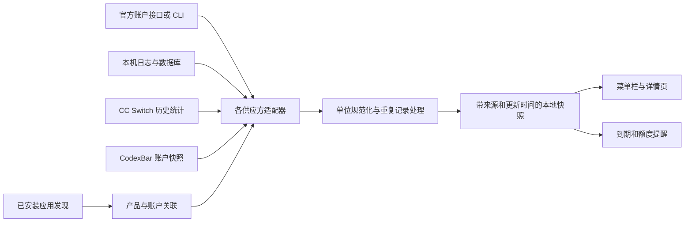

# Agent 用量菜单栏应用可行性研究

调研日期：2026 年 10 月 9 日。时间统一按北京时间显示。

这个应用可以做。建议定位为一个常驻 macOS 菜单栏的个人用量面板：集中查看各账户还能用多少、何时恢复额度、重置卡何时过期，以及本机消耗了多少 token。

当前最大的工作量在各产品的数据接入和统计口径。没有一个系统接口可以读取所有 Agent 的全部指标；应采用可扩展的供应方适配器，按字段显示已验证的数据，并明确标识待连接、暂不支持和过期状态。首轮研究已完成，应用尚未开发。

## 本机应用范围

在 `/Applications`、`~/Applications` 顶层及当前 PATH 中盘点到 **24 个相关桌面应用候选**，并发现 Codex、Claude Code、OpenCode、Qwen、Kimi CLI。桌面候选包含通用聊天应用、模型客户端和辅助工具，不等于 24 个独立计费账户。

| 类型 | 本机发现的应用或工具 |
| --- | --- |
| 编程与通用任务 Agent | ChatGPT 内的 Codex、Claude、Kimi Code、MiniMax Code、OpenCode、Qoder CN、Qoder CN IDE、TRAE SOLO CN、Trae CN、WorkBuddy、ZCode、DeepSeek Harness、Xiaomi MiMo、AutoGLM、妙手 |
| 聊天及电脑操作产品 | Kimi、KimiCU、Doubao、豆包浏览器 |
| 创作产品 | MiniMax Design |
| 多供应方或本地模型客户端 | Cherry Studio、LM Studio |
| 用量聚合及辅助工具 | CC Switch、Agent Launcher |
| 额外 CLI | Qwen；其余 CLI 与上面的桌面产品可能重叠 |

安装包里的 ChatGPT bundle ID 是 `com.openai.codex`；识别不能只按应用名。豆包浏览器目前只确认目录名。扫描范围不包括任意自定义目录、浏览器扩展、网页账户和其他电脑，因此这是一份接入候选清单，不是全机已登录账户清单。

完整路径、版本和 bundle ID 见 本机盘点 JSON（本机文件 `agent-app-inventory-2026-10-09.json`，不随源码上传）。

## 数据接入能力

“已实测”表示本轮读到了数据；“文档支持”表示存在官方依据但尚未验证本机账号；“界面支持”表示产品有该指标，但独立统计应用的读取方式仍待解决。

| 对象 | 用量及重置时间 | 重置卡或积分 | token | 当前判断 |
| --- | --- | --- | --- | --- |
| Codex | **已实测**账户额度及重置时间 | **已实测**积分余额、卡数量、逐卡到期时间 | 账户汇总接口有文档及本机协议支持；本机日志已验证 | 首个完整接入对象 |
| Claude Code | 官方 statusline 提供合格账户的窗口使用率及重置时间 | 不把 API 账单当作订阅剩余额度；卡片信息未确认 | 本机日志已验证，另有官方遥测 | 首批；后台独立刷新方式需验证 |
| Kimi Code | 官方本地服务提供 5 小时、7 天和月度窗口 | 官方字段包含加油钱包信息；卡片未确认 | 账户接口覆盖范围与日志格式需本机验证 | 首批；Server API 为实验性接口 |
| MiniMax Code | 官方 `mmx quota` 与订阅用量查询接口 | 积分包存在；逐包有效期和卡片读取字段待验证 | 以返回字段和本机日志验证为准 | 首批；按国内实际套餐接入 |
| Qoder CN 与 CN IDE | 官方 SDK 可查询账户额度 | 套餐积分、加购额度、组织资源包有文档 | SDK 有会话 token 和 Credits | 首批；时间字段和本机身份待验证 |
| ZCode | 官方界面有 5 小时、周及 MCP 月额度 | **官方确认重置卡及逐卡过期时间**；读取 API 未确认 | 官方界面区分本地会话与远端套餐统计 | 首批专项研究重置卡 |
| TRAE CN 与 SOLO CN | 官方网站有积分和用量明细 | 积分类型、增购信息有界面依据 | 个人版独立读取接口未确认 | 第二批，需验证中国版数据源 |
| WorkBuddy | 官方说明账户积分体系；开源工具有接入实现 | 订阅、加量、赠送积分及有效期；与 CodeBuddy 共享须去重 | 个人版 token 数据源待验证 | 第二批；账户连接方式需验证 |
| OpenCode | 额度来自所连接的供应方账户 | 不假设客户端有独立钱包 | **本机 SQLite 已验证有 token 字段** | 首批本地用量来源 |
| DeepSeek Harness | 应用账户与计费关系待确认 | DeepSeek API 有官方余额接口，但不等于 Harness 独立钱包 | 应用日志与账户接口需分别验证 | 第二批或后续 |
| MiniMax Design | 安装包有余额及钱包路由线索 | 与 MiniMax Code 分开验证；未实测余额 | 创作积分不能换算成通用 token | 创作类扩展 |
| Kimi、KimiCU、MiMo、AutoGLM、妙手、Doubao、豆包浏览器、Qwen | 本轮未完成独立用量接口验证 | 不借同品牌另一产品的额度代替 | 按实际后端与日志能力接入 | 待验证，纳入应用发现列表 |
| CC Switch | 本机数据库及上游统计实现已核验 | 有供应方用量查询机制，余额读取需单独验证；不代表覆盖重置卡 | 已有多应用会话与路由记录、缓存分类和估算成本 | 纳入首批，优先复用历史消耗统计 |
| Cherry Studio、LM Studio、Agent Launcher | 先识别客户端与实际供应方关系 | 辅助工具不能凭安装数量生成余额 | 能取得记录时归属到来源；本地模型另列 | 避免重复计费和重复统计 |

### Codex 已取得的真实快照

本轮通过 Codex 桌面的只读用量工具取得以下账户快照。它会随使用变化，不是持续运行的监控结果。

| 指标 | 读取结果 |
| --- | --- |
| 当前返回的额度窗口 | 10080 分钟，即 7 天 |
| 已用与剩余 | 已用 6%，剩余 94% |
| 下次重置 | 2026 年 10 月 15 日 11:21:33 |
| 当前返回的积分余额 | 0 |
| 可用重置卡 | 3 张 |
| 三张卡的到期时间 | 10 月 23 日 04:58:48；10 月 30 日 03:27:52；11 月 7 日 07:51:21 |

独立应用可研究调用官方 CLI 的 `account/rateLimits/read` 与 `account/usage/read`。本轮已离线核对安装版协议；独立 helper 的实际请求和账户 token 返回值仍待验证。卡总数以 `availableCount` 为准，详情列表可能不完整；缺失详情不能解释成没有卡。[官方 App Server 文档](https://learn.chatgpt.com/docs/app-server)

脱敏数据见 验证快照 JSON（本机文件 `codex-usage-snapshot-2026-10-09.json`，不随源码上传），未保存账户 ID、卡 ID 或凭据。

### 其他首批来源

- **Claude Code**：官方 statusline 有五小时及七天用量、重置时刻，但字段依赖账户资格，并在会话首次 API 响应后出现。它可以作为事件采集来源，不能承诺应用闲置时也持续刷新。官方遥测还提供 token 分类；客户端估算成本不等于账单金额。[statusline](https://code.claude.com/docs/en/statusline)、[Monitoring](https://code.claude.com/docs/en/monitoring-usage)
- **Kimi Code**：`kimi web` 的 `GET /api/v1/oauth/usage` 有 `limit5h`、`limit7d`、月度窗口及 `extraUsage`；应以安装版 `/openapi.json` 核对实验性协议。不能由此推定 Kimi 和 KimiCU 使用相同账本。[Server API](https://www.kimi.com/code/docs/en/kimi-code-cli/reference/server-api.html)
- **MiniMax Code**：国内官方 FAQ 提供 `mmx quota` 和 `GET https://www.minimax.cn/v1/token_plan/remains`。产品文档已迁移到 M Plan，旧套餐可能继续保留，因此不硬编码套餐倍率，也不混用国内 `.cn` 与海外 `.io`。[国内 FAQ](https://platform.minimax.cn/docs/m-plan/faq)
- **Qoder CN**：官方 SDK 的 `getUsageInfo()` 能在不启动 Agent 任务时查询账户套餐及加购额度。它是比抓界面更明确的接入入口；会话 Credits 与账户扣费属于不同层次，不能重复累计。[成本和用量](https://docs.qoder.cn/cli/sdk/cost-usage)
- **ZCode**：官方明确区分本机 token 与远端 Coding Plan，并显示重置卡逐张过期时间。需要登录并关联当前账户套餐；仅 API Key 接入不代表有卡。累计获得次数也不等于当前可用卡数。[使用统计](https://zcode.z.ai/cn/docs/usage-stats)
- **TRAE CN、WorkBuddy**：先验证中国版个人账户的余额来源，不套用海外或企业接口。WorkBuddy 的多个积分包有自己的有效期，并与同账号 CodeBuddy 共享积分。[TRAE 订阅管理](https://docs.trae.cn/ide_subscription-management)、[WorkBuddy 积分说明](https://www.codebuddy.cn/docs/workbuddy/Credits)

DeepSeek 的 `GET /user/balance` 可返回余额分类和币种，但没有逐笔赠送余额的到期时间。[官方余额接口](https://api-docs.deepseek.com/api/get-user-balance/)

MiniMax Design 的安装资源 `mcp-tools/dist/main.js` 第 36245、36247 行包含 `/api/v1/credit/balance` 和 `/api/v1/credit/wallet`。本轮静态工具注册列表没有余额查询工具；这些常量只证明存在实现线索，不证明接口已开放或可直接调用。

## 统计规则

建议建立两种视图：**账户额度**回答“还能用多少”，**应用消耗**回答“从哪里用掉的”。同一个供应方账户在多个客户端使用时，余额只显示一份，客户端作为关联入口。

| 指标 | 处理规则 |
| --- | --- |
| 额度使用率 | 每个账户、额度池、窗口分别显示，保留服务器原值；不平均不同供应方的百分比 |
| 额度恢复 | 区分下一次重置、滚动窗口恢复、套餐续期和积分过期；倒计时归零后重新查询，不直接假设恢复满额 |
| 重置卡 | 区分当前可用数量、累计获得数量、适用窗口、发放时间与到期时间；逐卡详情可能不全 |
| 积分及余额 | 保留单位、币种、钱包和来源；不同公司的积分不相加，赠送与购买余额能分则分 |
| token | 区分账户远端、本机已记录、单个任务；展示统计起止时间和覆盖范围 |
| 金额 | 区分供应方账单、积分扣除和按价格估算的金额；订阅 token 估价不当作实际花费 |
| 空值与异常 | 分别显示未提供、待登录、读取失败、缓存过期和真实零；同时标记最近成功更新时间 |

本机 token 抽样已发现真实重复记录，不能简单扫描数字求和：

- Codex 的 `total_token_usage` 是累计快照，要按会话及事件取增量；输入中的缓存部分、输出中的推理部分不能重复添加。fork 和恢复会话的继承历史仍需专门验证。
- Claude 的同一响应可在多个内容块重复记录。抽样一个文件有 353 条 usage，但按响应和请求键去重仅 155 组；子 Agent 也要覆盖且去重。
- OpenCode 的 session 汇总、assistant message 和 step-finish 都可能保存相同用量。优先按 message 唯一计数，其余作为对账依据；`cost=0` 不能推断实际免费。

这些是少量本机样本的结构验证，不是对全量历史账单完成了核对。

## 菜单栏交互建议

顶部常驻一个图标和可选的固定账户剩余比例。点击展开宽约 420 至 480 点的面板，默认显示常用账户，按搜索或分组查看其他应用。卡片优先显示剩余额度、恢复时间和即将到期的权益；token 历史放在详情页。

以下是布局草案；Codex 数值来自上面的单次快照，其他项用待连接状态表示。

```text
菜单栏   ◉  Codex 94%

Agent 用量                 刷新 · 设置
账户额度  |  应用消耗

Codex             7 天额度剩余 94%
重置              10 月 15 日 11:21
重置卡            3 张 · 最早 10 月 23 日到期
积分              0
Token             账户汇总待验证

ZCode             待连接
重置卡            等待读取卡片明细

Kimi Code         待连接
MiniMax Code      待连接
Qoder CN          待连接

查看全部应用       用量历史       打开原应用
```

提醒围绕额度不足、额度恢复、卡片到期、积分过期和连接失效设计。首版建议只做统计和提醒；使用重置卡、充值、切换账户会改变原服务状态，不包含在本次统计需求中。

## 技术路线与复用

建议采用 **SwiftUI 与 AppKit 原生菜单栏界面，加可替换的数据适配器**。持久化只保存必要的用量快照和去重信息。Apple 提供 `MenuBarExtra`；复杂弹窗可按需要使用 AppKit。[MenuBarExtra](https://developer.apple.com/documentation/swiftui/menubarextra)

复用方案由 **CodexBar、CC Switch 和官方接口** 共同组成。CodexBar 优先用于账户余量与重置状态，CC Switch 优先用于本机历史消耗，专用官方适配器补充逐卡信息与其他缺失字段。

[CodexBar](https://github.com/steipete/CodexBar) 上游已具备多供应方菜单栏和 CLI 能力，仓库使用 [MIT 许可证](https://github.com/steipete/CodexBar/blob/main/LICENSE)。当前 CLI 文档有 JSON 用量输出，以及 `resetCredits.available`、`resetCredits.nextExpiresAt`；本地 token 统计也已有部分支持。[CLI 文档](https://github.com/steipete/CodexBar/blob/main/docs/cli.md)

现成适配包含 [Kimi](https://github.com/steipete/CodexBar/blob/main/docs/kimi.md)、[Qoder](https://github.com/steipete/CodexBar/blob/main/docs/qoder.md) 和 [WorkBuddy](https://github.com/steipete/CodexBar/blob/main/docs/workbuddy.md)，但来源和认证方式不同；MiniMax 的现有适配针对 [Coding Plan](https://github.com/steipete/CodexBar/blob/main/docs/minimax.md)，不能据此承诺 MiniMax Design 的创作钱包。ZCode 卡片和 TRAE CN 仍需独立验证。

| 路线 | 适用点 | 需要承担的工作 |
| --- | --- | --- |
| 直接使用现有 CodexBar | 最快体验多供应方用量面板 | 你的中国版应用、逐卡明细和产品交互仍需逐项验收 |
| Fork CodexBar 后扩展 | 复用既有原生 UI、采集器与设置 | 跟进上游变化，补中国版和本机特有产品 |
| 自建原生界面，复用其 CLI 或部分采集器 | 更方便按你的账户与卡片逻辑设计，替换单个来源 | 需要管理 helper、认证交互、错误状态与版本兼容 |

**建议先并行验证 CodexBar CLI 的账户快照和 CC Switch 的本地历史统计，再决定直接扩展上游界面还是自建界面。** Codex 和 Qoder CN 这类官方协议明确的来源可以直接实现专用适配器。CLI 中的最近卡片到期摘要不能替代用户要求的逐卡详情。

本轮核查的是 2026 年 10 月 9 日上游 `main` 的文档与实现说明，并未安装运行 CodexBar，也未取得固定 commit。开始实施时先固定 release 或 commit，再对照本机版本验收；“上游支持某品牌”不等于“中国版及当前账户全部字段已接通”。

### CC Switch 复用方案

用户已明确将 CC Switch 用量统计加入复用范围。它可以减少重复编写日志解析、历史统计和费用估算的工作；首版仍保持独立的原生菜单栏界面。

| 可复用部分 | 放入本项目的位置 | 边界 |
| --- | --- | --- |
| 会话日志导入与历史数据 | 今日、近 7 天、近 30 天 token 和请求统计 | 只覆盖已导入的本地记录；安装应用与拥有历史记录分别判断 |
| 输入、输出、缓存分类 | token 明细与缓存命中率 | 先处理缓存是否已含在输入中的口径，再求总量 |
| 路由请求记录 | 按供应方、模型查看消耗和错误情况 | 只覆盖实际经过路由的请求；不会为了统计自动开启接管 |
| 模型定价及成本计算 | 可选的 API 等价费用估算 | 保留估算标签、模型与倍率，不解释成订阅实际账单 |
| 供应方用量查询 | 特定服务的余额与套餐查询适配器 | 先核对服务、地区、字段和认证；配置中存在脚本不代表应直接运行 |

上游提供上述统计与查询能力，前端通过 `get_usage_summary`、`get_usage_trends`、`queryProviderUsage` 等 Tauri 命令调用后端；这些是应用内部 IPC，不能当成已有的对外 HTTP 或 CLI 接口。[用量说明](https://github.com/farion1231/cc-switch/blob/main/docs/user-manual/zh/4-proxy/4.4-usage.md)、[调用层源码](https://github.com/farion1231/cc-switch/blob/main/src/lib/api/usage.ts)

**本机只读核验**：已安装 CC Switch 4.0.5，数据库为 `~/.cc-switch/cc-switch.db`，`user_version=20`。查询只读取表结构与聚合数量，没有读取供应方密钥、配置脚本或聊天内容。

| 本机表 | 调研快照 | 用途 |
| --- | --- | --- |
| `proxy_request_logs` | 约 1.49 万条记录，持续变化 | 有 Codex、Claude、Gemini、OpenCode、MiniMax Code 会话来源及路由来源；表名不代表记录全部来自代理 |
| `usage_daily_rollups` | 675 条汇总行，日期覆盖 2026 年 3 月 11 日至 9 月 9 日 | 保留较早历史；行数不是天数，不可与明细直接相加 |
| `model_pricing` | 220 条定价记录 | 估算费用的已有数据基础 |
| `session_log_sync` | 3039 条同步记录 | 同步进度线索，不直接当作会话数量或账户覆盖率 |

建议先做版本感知的 **CC Switch 只读数据库适配器**，用短事务取得一致快照，复用对应版本的查询规则。遇到未知 schema 应停止解析并提示升级适配，不能尝试迁移源数据库。CC Switch 未运行时已有历史仍可读，但新日志未必同步；需显示最近同步时间。日汇总与明细的保留边界、统计时区及当前窗口都要与原界面对账。

数据库不能简单 `SUM`：上游 `usage_stats.rs` 在查询阶段过滤会话与路由的重复记录，并处理历史汇总；本机还存在不同 `input_token_semantics` 标记。`session_usage_dedup` 表为空也不能证明没有重复。适配器要连同这些规则一起复用，不能只搬数据字段。[统计查询实现](https://github.com/farion1231/cc-switch/blob/main/src-tauri/src/services/usage_stats.rs)、[统计类型](https://github.com/farion1231/cc-switch/blob/main/src/types/usage.ts)

来源优先级按产品、指标和覆盖时段选择：本地消耗优先尝试 CC Switch；同一段历史的 CodexBar `cost` 或原始日志解析仅用于对账或回退，不加入同一总计。账户远端 token 继续单独显示。不同来源无法证明属于同一请求时保留各自覆盖范围，避免靠接近的时间强行合并。

如后续需要脱离 CC Switch 独立采集，可以再抽取其 Rust 统计与导入模块做本应用 helper。当前仓库标注 [MIT 许可证](https://github.com/farion1231/cc-switch/blob/main/LICENSE)；复用源码需保留相关声明，实施前固定版本并检查所用依赖。上游 `main` 与本机 4.0.5 的行为一致性尚未完成验收。

推荐的数据流为：



采集只向对应服务查询账户信息；本地日志仅提取用量、时间和必要去重键，不保存聊天正文。先用官方只读接口、CLI 和现有本地记录；需要登录态或界面采集的产品单独接入，避免影响所有来源。

刷新采用各来源独立策略：优先事件更新，支持的账户可低频查询；日志增量读取，面板倒计时本地更新。休眠唤醒或重置时刻到达后重新校验，失败时保留上次值并标记过期。首版不依赖一个持续运行的大模型来获取统计。

## 下一阶段建议与验收

建议范围是先发现所有本机相关应用，再按接入质量分批交付。生图和视频钱包暂作为可选扩展；这项范围偏好尚待用户确定。

- [x] 盘点本机应用及 CLI。
- [x] 获取 Codex 真实额度和重置卡快照。
- [x] 核对 Codex 独立协议，以及 Claude、OpenCode 本地 token 结构。
- [x] 查证 Kimi、MiniMax、Qoder CN、ZCode 等来源与开源复用方案。
- [x] 纳入用户指定的 CC Switch 复用，核验本机用量数据库及上游统计接口。
- [ ] 确认首版常用产品和创作类产品是否纳入。
- [ ] 做只读接入验证：Codex、Kimi Code、MiniMax Code、Qoder CN；并行解决 ZCode 卡片读取、Claude/OpenCode 的本机用量。
- [ ] 验证 CC Switch 只读适配器，与原应用对账 token、缓存、费用、历史汇总和跨来源去重；确定各指标主来源。
- [ ] 用真实数据核对额度、单位、时间、账户关联和重复记录，固定依赖版本。
- [ ] 确定原生菜单栏交互与复用方式，再实施应用。
- [ ] 补充 TRAE CN、WorkBuddy 及其他应用来源。

每个来源的接入验收应满足：与原应用在接近时间的显示相符；未启动生成任务获取数据；支持未登录及断网状态；时区和到期时间正确；不重复计算同一账户和同一请求；标明覆盖范围。只有达到这些条件，才把该字段标为“已支持”。

研究交付物包括本文、应用盘点和脱敏快照。没有修改原应用配置，没有消费重置卡，也没有安装或启动新的常驻服务。
